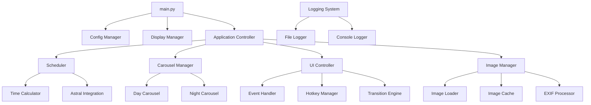

# Design Document

## Overview

The dual-carousel slideshow application is designed as a modular Python application that creates a fullscreen borderless window on a secondary monitor to display images from day and night folders based on configurable schedules. The architecture emphasizes separation of concerns, robust error handling, and maintainable code structure.

The application uses pygame for cross-platform window management and rendering, Pillow for image processing, and a configuration-driven approach for flexibility. The design supports both fixed time schedules and astronomical sunrise/sunset calculations for automatic carousel switching.

## Architecture

### High-Level Architecture



### Core Components

1. **Application Controller**: Central orchestrator managing component lifecycle and coordination
2. **Display Manager**: Handles monitor detection, window creation, and fullscreen management
3. **Carousel Manager**: Manages day/night image collections and playback state
4. **Scheduler**: Determines current mode (day/night) based on time or astronomical data
5. **Image Manager**: Handles image loading, processing, caching, and scaling
6. **UI Controller**: Manages user input, transitions, and rendering
7. **Config Manager**: Loads, validates, and provides configuration data

## Components and Interfaces

### Display Manager (`display.py`)

**Responsibilities:**
- Monitor enumeration and selection
- Fullscreen window creation on target monitor
- Window positioning and properties management

**Key Methods:**
```python
class DisplayManager:
    def get_monitors() -> List[MonitorInfo]
    def select_monitor(index: int) -> MonitorInfo
    def create_fullscreen_window(monitor: MonitorInfo) -> pygame.Surface
    def set_window_properties(always_on_top: bool, hide_cursor: bool)
```

### Image Manager (`images.py`)

**Responsibilities:**
- Image file discovery and filtering
- EXIF orientation processing
- Image scaling and caching
- Performance optimization through preloading

**Key Methods:**
```python
class ImageManager:
    def scan_folder(path: str, include_subfolders: bool) -> List[str]
    def load_image(path: str) -> PIL.Image
    def process_exif_orientation(image: PIL.Image) -> PIL.Image
    def scale_image(image: PIL.Image, target_size: Tuple[int, int], mode: str) -> pygame.Surface
    def preload_images(paths: List[str], target_size: Tuple[int, int])
```

### Carousel Manager (`carousel.py`)

**Responsibilities:**
- Managing separate day and night image collections
- Playback state (current index, shuffle order)
- Navigation (next, previous, jump to index)
- Resume functionality

**Key Methods:**
```python
class CarouselManager:
    def load_carousel(folder_path: str, shuffle: bool) -> Carousel
    def get_current_image() -> str
    def advance_image() -> str
    def previous_image() -> str
    def switch_carousel(mode: CarouselMode)
    def save_resume_state()
    def load_resume_state()
```

### Scheduler (`scheduler.py`)

**Responsibilities:**
- Time-based mode determination
- Fixed schedule calculations
- Astronomical sunrise/sunset calculations
- Manual override handling

**Key Methods:**
```python
class Scheduler:
    def get_current_mode() -> CarouselMode
    def calculate_next_switch_time() -> datetime
    def set_manual_override(mode: CarouselMode)
    def clear_manual_override()
    def update_sun_times(date: datetime)
```

### UI Controller (`ui.py`)

**Responsibilities:**
- Main event loop management
- Hotkey processing
- Image transitions and rendering
- Cursor management

**Key Methods:**
```python
class UIController:
    def run_main_loop()
    def handle_events() -> bool
    def process_hotkeys(event: pygame.Event)
    def render_frame(current_image: pygame.Surface, next_image: pygame.Surface)
    def perform_transition(from_image: pygame.Surface, to_image: pygame.Surface)
```

## Data Models

### Configuration Schema

```python
@dataclass
class DisplayConfig:
    monitor_index: int = 1
    always_on_top: bool = True
    hide_cursor_after_ms: int = 2000
    background_color: str = "#000000"

@dataclass
class ScheduleConfig:
    mode: str = "fixed"  # "fixed" or "sun"
    fixed_schedule: FixedScheduleConfig = None
    sun_schedule: SunScheduleConfig = None

@dataclass
class PlaybackConfig:
    interval_seconds: int = 60
    shuffle: bool = True
    fit_mode: str = "cover"  # "cover" or "fit"
    transition_ms: int = 300
    reload_images_every_seconds: int = 300
    resume_index_between_runs: bool = True

@dataclass
class FolderConfig:
    day: str
    night: str
    include_subfolders: bool = True

@dataclass
class AppConfig:
    display: DisplayConfig
    schedule: ScheduleConfig
    playback: PlaybackConfig
    folders: FolderConfig
    logging: LoggingConfig
```

### Runtime State Models

```python
@dataclass
class MonitorInfo:
    index: int
    x: int
    y: int
    width: int
    height: int
    is_primary: bool

@dataclass
class CarouselState:
    current_index: int
    image_paths: List[str]
    shuffle_order: List[int]
    last_reload_time: datetime

@dataclass
class ApplicationState:
    current_mode: CarouselMode
    is_paused: bool
    manual_override: Optional[CarouselMode]
    last_image_change: datetime
    day_carousel: CarouselState
    night_carousel: CarouselState
```

## Error Handling

### Error Categories and Strategies

1. **Configuration Errors**
   - Invalid monitor index → fallback to largest non-primary monitor
   - Missing folders → create default folders and log warning
   - Invalid time formats → use default schedule

2. **Image Loading Errors**
   - Corrupted files → skip and log error, continue with next image
   - Empty folders → display fallback message, retry scanning periodically
   - EXIF processing errors → use image without rotation correction

3. **Display Errors**
   - Monitor disconnection → detect and switch to available monitor
   - Window creation failure → retry with different display mode
   - Rendering errors → log error and attempt to continue

4. **System Integration Errors**
   - File system access issues → log error and use cached data
   - Task scheduler integration → provide manual startup instructions
   - Lock file conflicts → handle gracefully with user notification

### Error Recovery Mechanisms

```python
class ErrorHandler:
    def handle_image_error(self, path: str, error: Exception)
    def handle_display_error(self, error: Exception) -> bool
    def handle_config_error(self, section: str, error: Exception)
    def should_retry_operation(self, error_type: str, attempt_count: int) -> bool
```

## Testing Strategy

### Unit Testing Approach

1. **Configuration Testing**
   - Valid/invalid configuration parsing
   - CLI argument override behavior
   - Default value application

2. **Image Processing Testing**
   - EXIF orientation handling
   - Scaling algorithms (cover vs fit modes)
   - File format support validation
   - Error handling for corrupted files

3. **Scheduler Testing**
   - Fixed schedule calculations across midnight boundaries
   - Sunrise/sunset calculations for various locations and dates
   - Manual override behavior
   - Edge cases (polar regions, DST transitions)

4. **Carousel Logic Testing**
   - Shuffle algorithm consistency
   - Index wrapping behavior
   - Resume state persistence
   - Empty folder handling

### Integration Testing

1. **Display Integration**
   - Multi-monitor scenarios
   - Window positioning accuracy
   - Fullscreen behavior validation

2. **File System Integration**
   - Folder scanning with various file structures
   - File watching for auto-reload functionality
   - Permission handling

3. **System Integration**
   - Task scheduler compatibility
   - Single instance enforcement
   - Resource cleanup on exit

### Performance Testing

1. **Memory Usage**
   - Image cache size limits
   - Long-running memory stability
   - Garbage collection effectiveness

2. **Rendering Performance**
   - Transition smoothness
   - Large image handling
   - CPU usage optimization

### Manual Testing Scenarios

1. **Multi-Monitor Configurations**
   - Different resolutions and arrangements
   - Primary/secondary monitor switching
   - Monitor disconnection/reconnection

2. **Extended Runtime Testing**
   - 24-hour continuous operation
   - Memory leak detection
   - Error accumulation monitoring

3. **User Interaction Testing**
   - Hotkey responsiveness
   - Mode switching behavior
   - Pause/resume functionality

## Implementation Notes

### Performance Optimizations

1. **Image Caching Strategy**
   - Preload next 2-3 images in background
   - Cache scaled surfaces for target monitor resolution
   - Implement LRU eviction for memory management

2. **Rendering Optimizations**
   - Use pygame's hardware acceleration when available
   - Minimize surface conversions
   - Optimize transition calculations

3. **File System Efficiency**
   - Batch file operations
   - Use file modification times for change detection
   - Implement efficient folder scanning

### Security Considerations

1. **File Access**
   - Validate all file paths to prevent directory traversal
   - Handle permission errors gracefully
   - Sanitize configuration inputs

2. **System Integration**
   - Run with minimal required privileges
   - Validate Task Scheduler integration
   - Secure log file handling

### Deployment Strategy

1. **Dependency Management**
   - Pin specific library versions
   - Provide clear installation instructions
   - Handle missing dependencies gracefully

2. **Configuration Distribution**
   - Provide example configuration files
   - Document all configuration options
   - Validate configuration on startup

3. **Windows Integration**
   - Provide Task Scheduler setup scripts
   - Create desktop shortcuts with proper arguments
   - Handle Windows-specific path formats